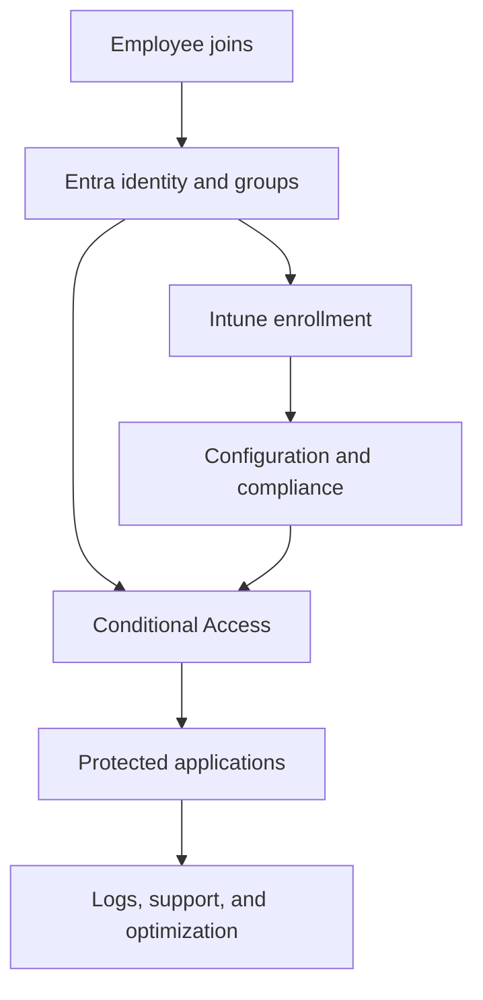

# Secure Modern Workplace Solution Demo

> A discovery-to-demo case study showing how I translate customer challenges into a clear Microsoft identity, endpoint, and security solution.

**Status:** Storyboard and solution planning  
**Client:** Northstar Telehealth Solutions *(fictional)*  
**Primary roles demonstrated:** Solutions Engineer · Solutions Consultant · Technical Account Partner

## Executive Summary

Northstar struggles with manual onboarding, unmanaged devices, inconsistent access requirements, excess privilege, and limited visibility. These challenges increase support costs, create security exposure, and make growth harder.

This project presents a secure modern workplace solution built around Microsoft Entra ID and Microsoft Intune. The focus is not only on product features—it shows discovery, solution mapping, demonstration design, objection handling, success criteria, and a phased implementation recommendation.

## Customer Challenges

| Challenge | Business effect | Proposed capability |
|---|---|---|
| Manual onboarding | Delayed productivity and inconsistent access | Group-based identity and application assignment |
| Inconsistent MFA | Higher account-compromise risk | Entra authentication and Conditional Access |
| Unmanaged devices | Limited assurance for sensitive access | Intune enrollment and compliance |
| Excess privilege | Larger impact from credential misuse | Least privilege and PIM |
| Configuration drift | Support burden and uneven security | Intune configuration and security policies |
| Limited evidence | Difficult audits and investigations | Centralized reporting and operational review |

## Discovery Framework

### Business questions

- What outcomes are driving the initiative now?
- Which users and workflows are most critical?
- What does delayed onboarding cost the organization?
- Which applications and data require stronger protection?
- What audit, customer, or regulatory commitments matter?
- How will stakeholders measure success?

### Technical questions

- How are users, groups, and roles created today?
- Which identity sources and applications are in scope?
- What device types and ownership models exist?
- Which authentication and access policies are already deployed?
- How are endpoints configured, patched, monitored, and retired?
- Which exceptions, dependencies, and licensing constraints exist?

## Proposed Solution



## Demo Storyline

1. Introduce the customer challenge and desired outcome.
2. Onboard a fictional new employee.
3. Assign access through role-aligned groups.
4. Enroll and configure a Windows endpoint.
5. Evaluate device compliance.
6. Attempt access from compliant and noncompliant conditions.
7. Demonstrate administrator privilege activation.
8. Review operational visibility.
9. Close with business outcomes and next steps.

## Demo Success Criteria

- The audience can connect every feature to an agreed customer problem.
- The happy path is concise and reproducible.
- At least one controlled failure demonstrates security value.
- Technical prerequisites and limitations are stated accurately.
- The close summarizes outcomes, risks, and recommended next steps.
- A backup path exists if the live demonstration fails.

## Objections to Prepare For

| Objection | Response direction |
|---|---|
| “This will frustrate users.” | Pilot by persona, measure impact, and use context-aware controls |
| “We already have MFA.” | Evaluate coverage, methods, exceptions, and privileged scenarios |
| “Our devices are already secure.” | Validate posture consistently and use it in access decisions |
| “Migration is too risky.” | Use staged deployment, report-only evaluation, testing, and rollback |
| “We do not have enough staff.” | Prioritize high-value controls and create repeatable operations |
| “How do we prove value?” | Track onboarding time, coverage, compliance, incidents, and support effort |

## Planned Sales Engineering Artifacts

- Account and stakeholder brief
- Discovery questionnaire
- Problem-to-capability matrix
- Current-state and future-state diagrams
- Demo agenda and script
- Technical runbook
- Objection-handling guide
- Implementation roadmap
- Executive presentation
- Recorded demonstration
- Follow-up summary

## Repository Roadmap

- [ ] Create account and persona brief
- [ ] Complete discovery plan
- [ ] Build solution architecture
- [ ] Write demo script and technical runbook
- [ ] Prepare sample user and device journeys
- [ ] Build executive slides
- [ ] Record and review demonstration
- [ ] Publish outcomes and lessons learned

## Planned Repository Structure

```text
account-brief/       Customer, stakeholders, and priorities
discovery/           Questions, notes template, and requirements
solution-design/     Architecture and capability mapping
demo/                Agenda, script, runbook, and backup plan
objections/          Objection handling and competitive framing
business-case/       Outcomes, measures, and phased roadmap
presentation/        Executive presentation
recording/           Demo link and transcript
```

## Technical Foundations

- [Entra ID Enterprise Implementation](https://github.com/sclem34/entra-id-enterprise-implementation)
- [Intune Secure Endpoint Deployment](https://github.com/sclem34/intune-secure-endpoint-deployment)
- [Zero Trust Access Lab](https://github.com/sclem34/zero-trust-access-lab)

## Disclaimer

This case study uses a fictional customer and sanitized lab data. It is intended to demonstrate technical discovery, solution design, and communication—not to represent a production customer engagement.
